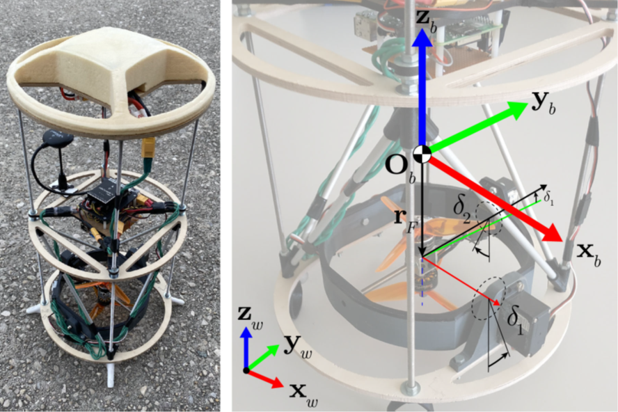

# Rocket_MPC
This project is part of the course Model Predictive Control given at EPFL during fall semester 2021. The objective is to control a rocket-inspired drone using MPC. The model can be seen as a flying inverted pendulum. The first controller implementation linearizes the model to use MPC. The second one is directly applying an NMPC controller to the model.

Optimization is done using the solvers [gurobi](https://www.gurobi.com/lp/or/gurobi-optimizer/?utm_source=google&utm_medium=cpc&utm_campaign=2022+q2+general&campaignid=2027425882&adgroupid=138872525640&creative=596136109137&keyword=gurobi%20solver&matchtype=e&gclid=Cj0KCQjwnvOaBhDTARIsAJf8eVPjF2hzzPBsn1ccMFhSR4z-EBSR7MjxNWpFsQQVSCZpsztmoWtGYHwaAtioEALw_wcB) and ipopt from [OPTI Toolbox](https://github.com/jonathancurrie/OPTI) through the [Yalmip](https://yalmip.github.io/) interface on Matlab.
